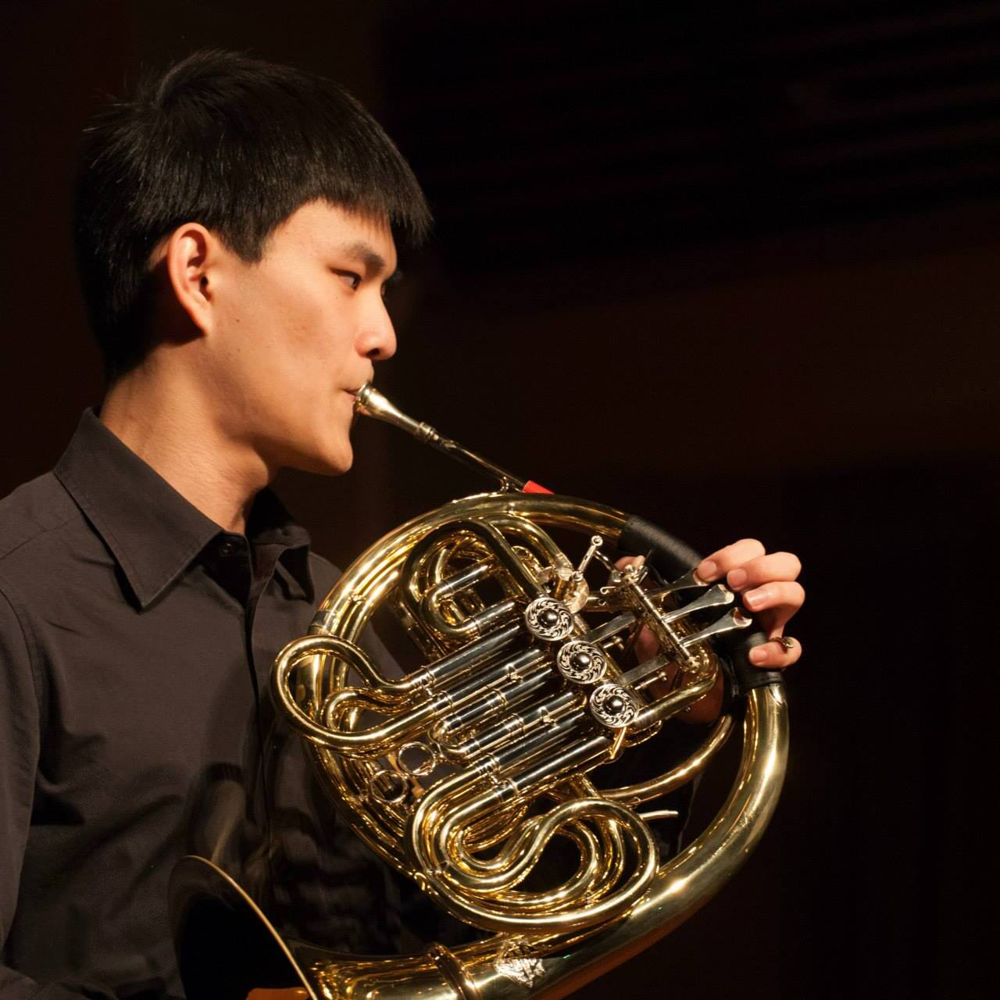
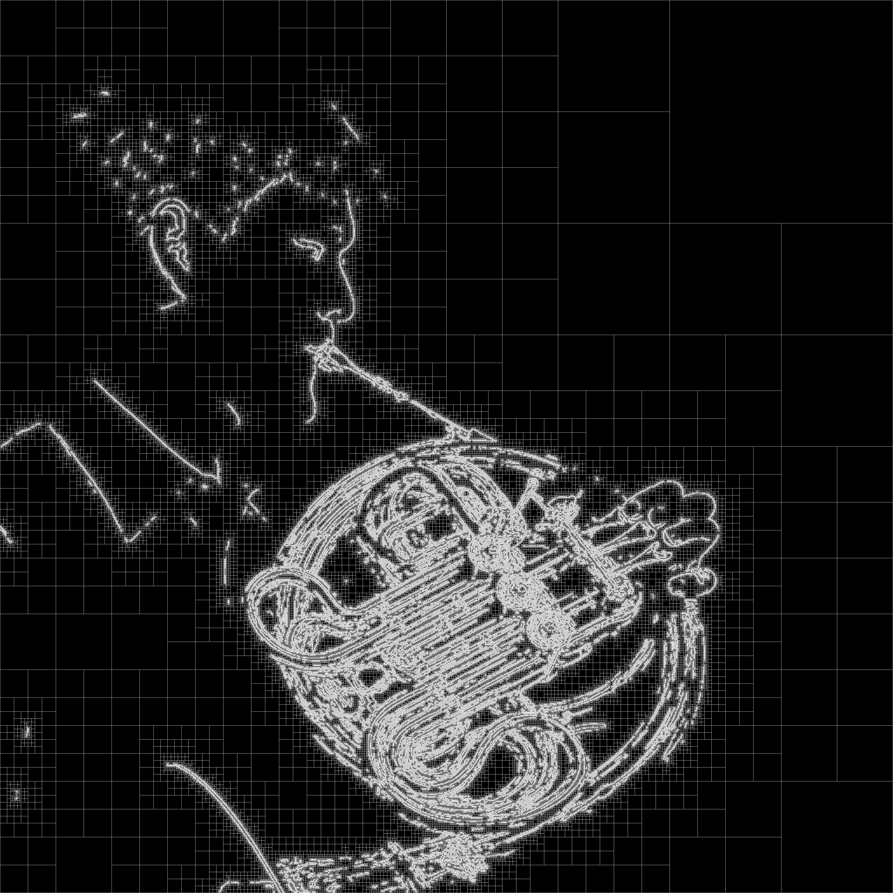

# Adaptive Mesh Refinement Art

Create a cool image with Adaptive Mesh Refinement!

## Dependencies

- [Go](https://go.dev/): download Go version 1.17.6 from [go.dev](https://go.dev/dl/)
- [OpenCV](https://opencv.org/): install with `brew install opencv`

## Usage

```sh
go run ./scripts/main.go [arguments]
```

### Arguments

```
-i string (default "input.png")

    Input file

-lv int (default 12)

    Maximum refinement level

-o string (default "output.png")

    Output file

-t1 float (default 50)
-t2 float (default 70)

    Canny finds edges in an image using the Canny algorithm.
    The function finds edges in the input image image and marks them in the output map edges using the Canny algorithm.
    The smallest value between t1 and t2 is used for edge linking. The largest value is used to find initial segments of strong edges.
    References:
    - https://en.wikipedia.org/wiki/Canny_edge_detector
    - https://docs.opencv.org/4.5.5/da/d22/tutorial_py_canny.html
```

- Example: execute with [the script](./scripts/main.go)

  ```sh
  go run ./scripts/main.go -i ./scripts/input.jpeg -o ./scripts/output.png -lv 12 -t1 50 -t2 70
  ```

  |            [input.jpeg](./scripts/input.jpeg)            |            [output.png](./scripts/output.png)             |
  | :------------------------------------------------------: | :-------------------------------------------------------: |
  |  |  |
